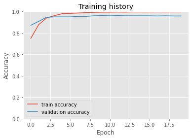
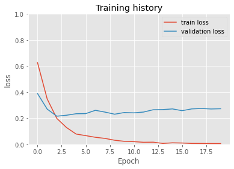
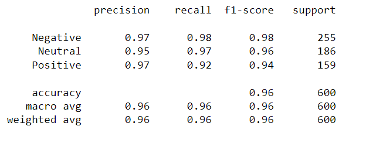
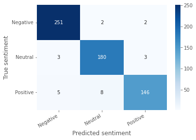

# Aspect_Based_Sentiment_Extraction
Created on: 5th Jan, 2022.

This project deals with an important field of Natural Lnaguage Processing - <b>Aspect Based Sentiment Analysis (ABSA)</b>. But the problem statement here is rather a simplified version of the more general ABSA.<br>
Aspect-Based Sentiment analysis is a type of text analysis that categorizes opinions by aspect and identifies the sentiment related to each aspect. Aspects are important words that are of importance to a business or organization, where they want to be able to provide their customers with insights on how their customers feel about these important words.<br>
The general ABSA problem, which is an active area of machine learning research, is about finding all the possible aspects and the corresponding sentiments associated with those aspects in a given text or a document. For example, given a sentence like *“I like apples very much, but I hate kiwi”*, an ideal absa system should be able to identify aspects like apples and kiwi with correct sentiments of positive and negative respectively.<br>
But here, in the problem statement that this project deals with, an aspect word/phrase is already given from the given text, which means that our problem is rather simplified and we don’t need to worry about the complex task of identifying aspects as well in the text, at least for this problem statement that I am dealing with. In future, I will be working with the more general version of this problem, where aspects are also needed to be indentified.<hr>

## A brief description of approach
This work explores the use of a **pre-trained language model, BERT (Bidirectional Encoder Representaton from Transformers)**, for the purpose of solving the aforementioned problem. BERT offers very robust contextual embeddings which are useful to solve the variety of problems. Therefore, the sole idea here is to explore the modelling capabilities of the BERT embeddings, by making use of the sentence pair input for the aspect sentiment prediction task. The model which I came up with was able to achieve **99.40%** accuracy on the training data and **96.16%** accuracy on the test data.

## Instructions to run and test files
**Clone this repository and navigate to the project folder:** <br>
```git clone https://github.com/stardust-88/Aspect_Based_Sentiment_Extraction.git```<br>
```cd Aspect_Based_sentiment_Extraction```

**To install the dependencies:** <br>
```pip3 install -r requirements.txt```

**To train:** <br>
Navigate to the src folder and run the below command:<br>
```python train.py```

**For inference:** <br>
Navigate to the src folder and run the below command:<br>
```python inference.py```

### Instructions for using trained model weights
I have saved my trained weights to google drive and generated the link, which can be used to download the same. This can be done through below steps.<br>
1. Navigate to the the models directory.
2. When inside the models directory, run the file download_model.py: ```python download_model.py```

So, if the user wants to do the inference using pre-trained weights, first download the weights following above two steps, then then run the inference.py script.

## Results from the model

1. Accuracy curve:


2. Loss curve:


3. Classification report:


4. Confusion matrix:



